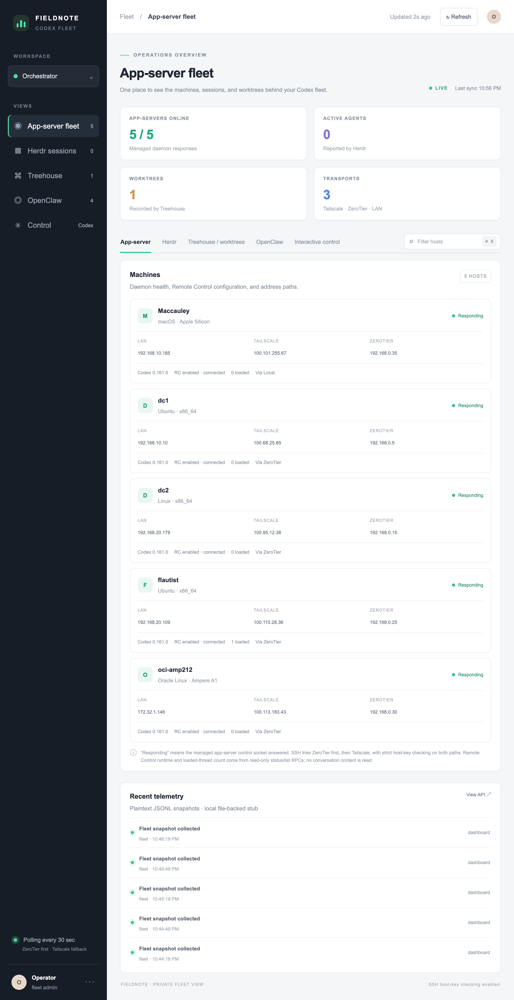
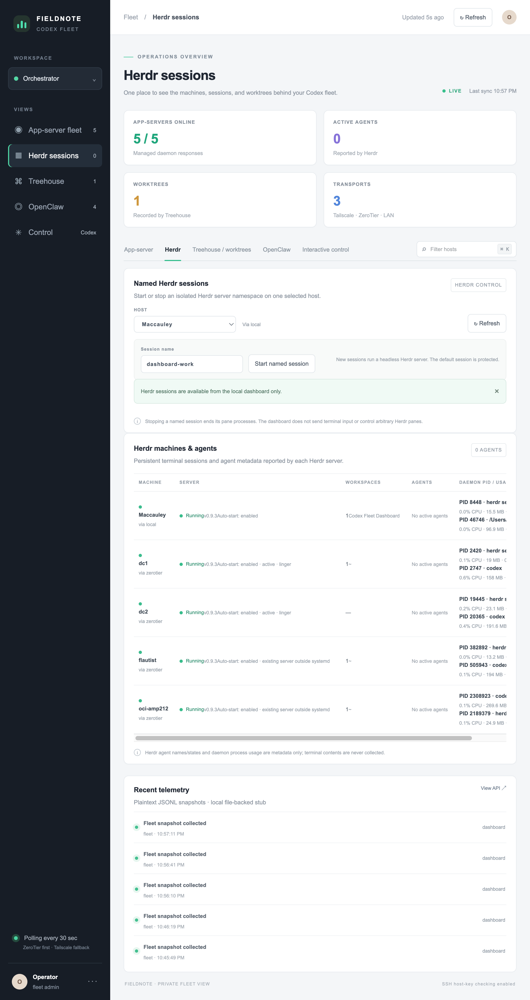
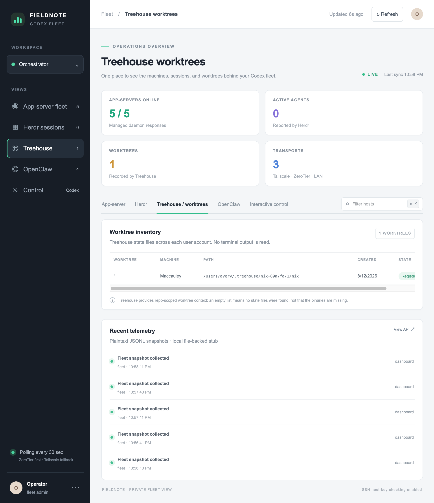
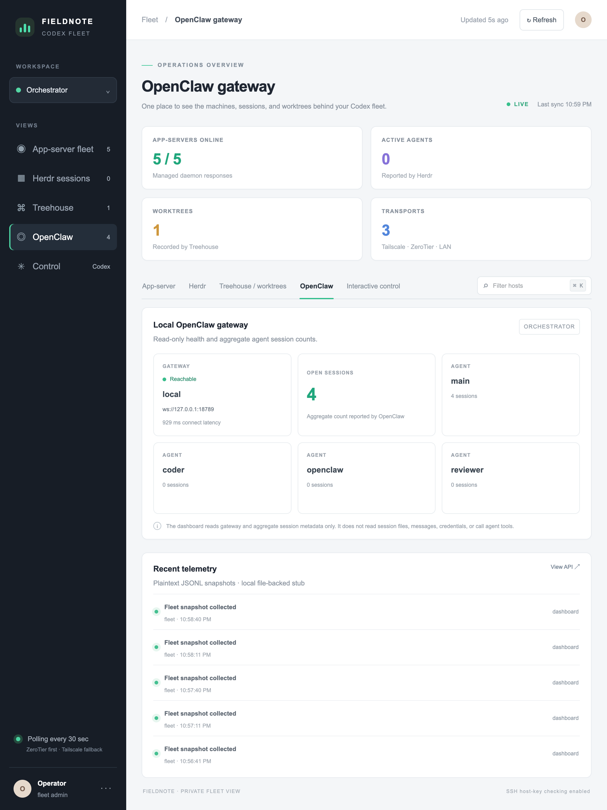
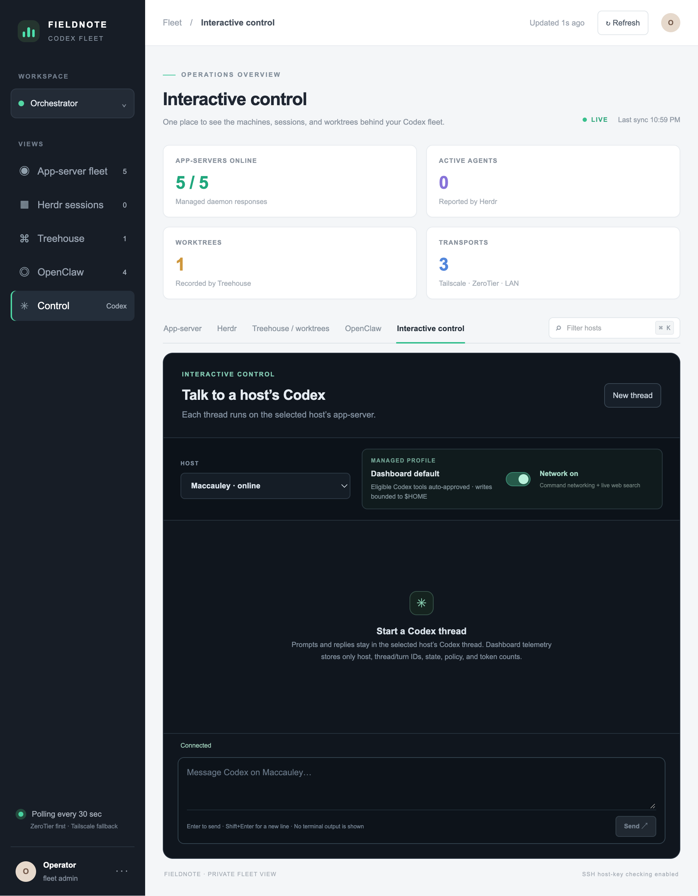

# Codex Orchestrator Dashboard

A self-hosted dashboard for Codex app-server health and fleet sync, Herdr sessions, Treehouse worktrees, and an optional local OpenClaw gateway. The Next.js app collects bounded metadata through local probes and SSH; it does not collect prompts, terminal output, credentials, or conversation contents. Codex sync is an operator-started compare, review, and apply flow; routine health polling never writes host state.

**Operator and maintainer guide:** [codex-orchestrator-dashboard documentation](https://averyfreeman.github.io/codex-orchestrator-dashboard/). The guide is a static GitHub Pages site; the interactive dashboard and its control APIs remain self-hosted.

## Dashboard screenshots

These full-screen captures show the app-server fleet, Herdr sessions, Treehouse worktrees, OpenClaw gateway, and interactive control views. They reflect a configured fleet and include operational host and process metadata. The separate static preview uses fictional hosts, disabled controls, and no live connections.











To inspect the synthetic fixture locally, run `npm ci` and `npm run docs:dev`, then open `http://127.0.0.1:4321/codex-orchestrator-dashboard/dashboard-preview/`.

## Run locally

```bash
npm ci
npm run dev
```

The example inventory is empty, so the dashboard makes no remote connections until a private inventory is configured. Copy `config/fleet.example.json` to the ignored `config/fleet.local.json`, then add the hosts you intend to monitor. `FLEET_CONFIG_PATH` can point to another private inventory file.

An inventory host has this shape:

```json
{
  "slug": "node-a",
  "name": "Node A",
  "os": "Linux",
  "localIp": null,
  "tailscaleIp": null,
  "zerotierIp": null,
  "codexHome": "~/.codex-work",
  "sshRoutes": [
    { "transport": "zerotier", "target": "operator@node-a.example.test", "hostKeyAlias": "fleet-node-a" },
    { "transport": "tailscale", "target": "operator@node-a.example.test", "hostKeyAlias": "fleet-node-a" }
  ]
}
```

`codexHome` is optional; omit it to use `~/.codex`. Set it per host when Codex uses another home. Supported values are `~`, a path under the host user's home such as `~/.codex-work`, or an absolute path; parent-directory traversal is rejected. For the local host, the dashboard process's `CODEX_HOME` environment variable is used when there is no inventory override. Keep the local inventory and SSH private keys outside the public repository.

Routes are tried in listed order; use ZeroTier first and Tailscale as failover. Each SSH call requires batch mode and strict host-key checking with the configured alias. LAN addresses are displayed only and are not SSH routes.

## Current dashboard surface

- **App-server fleet** — health, version, Remote Control state, startup status, the route used to reach each host, and a down-only daemon start action.
- **Codex sync** — inspect a selected reference host and reachable peers, review safe differences, and apply selected CLI, plugin, config/profile, and user-skill changes. Each host keeps its own resolved `CODEX_HOME`; paths are normalized for comparison and the full override path stays private.
- **Herdr** — daemon state, workspaces, agent metadata, and process CPU/RSS.
- **Treehouse** — registered worktree names and paths.
- **OpenClaw** — optional local gateway health and aggregate session counts, projected from `openclaw status --json`.
- **Telemetry** — bounded JSONL snapshots in the ignored `logs/` directory.

The dashboard also has an **Interactive control** view for creating or resuming Codex threads on one explicitly selected host, streaming assistant output, observing turn activity and token usage, and interrupting a specific turn. The local gateway reaches the host-local app-server control socket over strict SSH (ZeroTier first, Tailscale failover). Prompts and replies belong to the remote Codex thread; dashboard JSONL telemetry excludes them and excludes terminal output. Herdr named-session controls and optional explicit OpenClaw delegation remain separate integrations.

To synchronize Codex hosts, open **Codex sync**, select a reference and target hosts, review the plan, then apply it. The published [Codex sync walkthrough](https://averyfreeman.github.io/codex-orchestrator-dashboard/operators/codex-sync/) explains the full workflow, `CODEX_HOME` setup, blocked differences, and restart outcomes.

The [documentation site](https://averyfreeman.github.io/codex-orchestrator-dashboard/) covers setup, Codex sync, controls, permissions, recovery, architecture, protocols, telemetry, development, API routes, and helper scripts.

The shared Codex user defaults on Maccauley and configured Linux hosts use model `gpt-6-luna`, maximum reasoning effort, `approval_policy = "never"`, and a `workspace-write` sandbox with the host user's `$HOME` as an additional writable root. Sandbox command networking and live web search start enabled. The shared-profile synchronizer preserves host-local auth and unrelated MCP/plugin settings; Codex fleet sync has its own reviewed plugin/config/profile flow described in the walkthrough. Dashboard-managed work sends the same home boundary and approval policy to the selected host's app-server. Its **Network access** switch starts on and applies to subsequent turns: on enables sandboxed command networking plus live Codex web search; off disables both. A profile preference is stored locally under the ignored `.dashboard-state/` directory with owner-only permissions. This is a high-trust default: eligible tools can access the network and write anywhere under that host user's home directory. Out-of-home file permissions are declined. Independent connector, browser, and operating-system prompts retain their own controls.

The control API is intended for a local dashboard bound to loopback. The provided `npm run dev` and `npm start` commands bind to `127.0.0.1`, which is the access boundary; same-origin checks are CSRF protection, not authentication. Do not expose the dashboard through a reverse proxy or bind it to a network interface without adding user authentication and CSRF protection.

## Telemetry and retention

The collector returns status, versions, aggregate counts, process CPU/RSS, and worktree metadata. It polls every 30 seconds in the UI. Collection and rendering make no model calls, so observation has no token cost. Interactive Codex work uses the selected model and account; app-server token-usage notifications are reported without another model call. Resource use depends on SSH latency and host count; the research note gives a sizing heuristic and benchmark plan. Local JSONL files should be treated as private operational data. Keep retention short and never add prompts, tool output, environment variables, or auth material.

`POST /api/logs` accepts events only when `LOG_INGEST_TOKEN` is set. The logs route returns bounded recent snapshots. Keep `.env.local` private; it is ignored by Git.

## Host setup

`ansible/inventory.py` builds a dynamic inventory from the private fleet file and selects the first responding route in the configured order. The Linux playbook installs or reconciles Codex and Herdr user services and applies the shared fleet profile. Run `ansible-playbook -i inventory.py --tags codex_profile playbooks/sync-linux-fleet.yml` to propagate only Codex defaults without changing service state. Profile sync does not overwrite local MCP/plugin configuration or auth files. The same helper can be run locally on Maccauley with `python3 scripts/sync_codex_profile.py --write`.

The macOS LaunchAgent templates under `macos/LaunchAgents` use a generic label for new installs. The installer detects an already-loaded matching Codex or Herdr label by suffix and preserves that label. LaunchAgents run in a GUI user session; Linux services use the user systemd manager.

Use `CODEX_CLI_PATH` and `OPENCLAW_CLI` if the relevant binaries are not on the dashboard process `PATH`.

## Architecture and research

See [`docs/architecture.md`](docs/architecture.md) for the system model and Mermaid flows, [`docs/research/interactive-control-options.md`](docs/research/interactive-control-options.md) for protocol/telemetry research with primary-source links, and [`CONTEXT.md`](CONTEXT.md) for the project vocabulary. Decisions are recorded in [`docs/adr/`](docs/adr/).

## Git workflow

`.githabits.yaml` records the allowed Git actions. The project Stop hook runs the public-snapshot scanner and repository checks, then stages, commits, creates a patch tag, and pushes to `main`. Codex’s Stop event does not expose an authoritative turn status, so exact completed-versus-failed gating requires the dashboard’s app-server event stream. Prototype work stays on its own branch. Codex requires local review and trust for project hooks; open `/hooks` in the Codex app to activate this workflow after reviewing the hook definition.

## Development checks

```bash
npm test
npm run lint
npx tsc --noEmit
npm run build
python3 scripts/test_sync_codex_profile.py
python3 -m unittest scripts/test_codex_control.py scripts/test_codex_recovery.py scripts/test_herdr_sessions.py
python3 -m unittest scripts/test_codex_sync.py
python3 -m unittest scripts/test_macos_launchagents.py
python3 -m py_compile scripts/probe.py scripts/codex_control.py scripts/codex_recovery.py scripts/codex_sync.py scripts/herdr_sessions.py scripts/sync_codex_profile.py ansible/inventory.py
python3 scripts/check_public_snapshot.py
cd ansible && ansible-playbook -i inventory.py --syntax-check playbooks/sync-linux-fleet.yml
```
