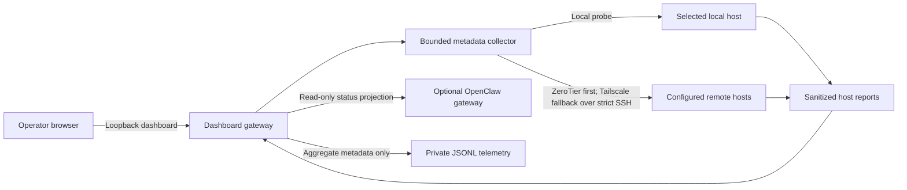
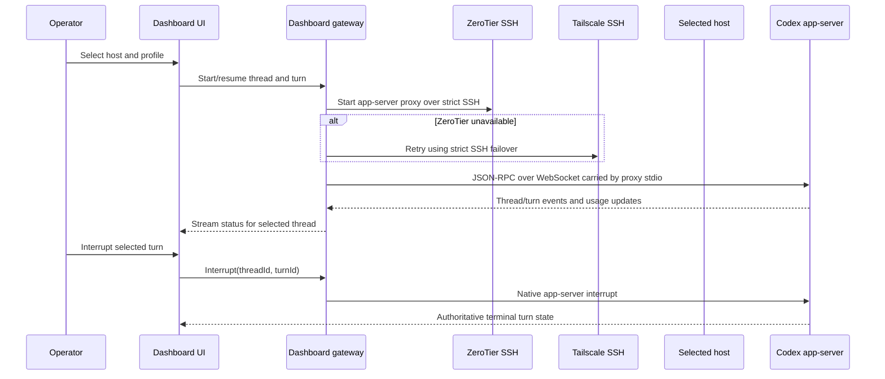

# Architecture and operating model

## System shape

The dashboard has two planes:

- **Observe:** the Next.js gateway polls bounded host metadata and presents Codex app-server, Herdr, Treehouse, and optional OpenClaw state.
- **Control:** a same-origin loopback API connects to one explicitly selected host’s Codex app-server for thread/turn work and Herdr’s named-session interface for listing, starting, and stopping isolated sessions. OpenClaw delegation remains a separate, explicit future path.

The host inventory and SSH keys are private local configuration. Remote SSH uses the first configured route, with ZeroTier first and Tailscale as failover. Both routes use `BatchMode=yes`, strict host-key checking, and a stable per-host key alias. The dashboard does not expose general SSH or service-manager actions.

## 1. Observation and metadata flow

The collector reports connectivity, versions, aggregate counts, process CPU/RSS, and worktree metadata. It excludes prompts, transcripts, terminal output, credentials, and process environment variables. The UI polls host metadata every 30 seconds. The Codex control stream projects assistant text, activity labels, terminal turn state, and token usage into the selected browser session; raw tool output is excluded from dashboard telemetry and status events.

## 2. Selected-host Codex interaction

The managed daemon's control socket is WebSocket-based; `codex app-server proxy` carries that bidirectional connection over stdio. The dashboard uses an SSH subprocess as the private transport and leaves the app-server endpoint on the host. Show the selected host, profile, thread, and turn throughout the interaction. If a browser disconnects, the proxy closes but the turn may continue on the daemon; do not imply it stopped. Reconnect and reconcile with app-server state before treating it as finished.

Use Codex app-server directly for Codex threads and turns. Use Herdr’s named-session interface for Herdr start/stop and state. The `default` Herdr session is protected; only validated named sessions can be started or stopped, and each mutation is sent once over the route that passed a read-only session listing. If the selected host reports its Codex daemon down, the dashboard offers one fixed `codex app-server daemon start` recovery action over its configured route; the endpoint rechecks status and refuses to start a daemon that is already responding. It does not restart a responding daemon or expose arbitrary SSH or service-manager commands. If the host is unreachable, report route failures and do not imply a turn was interrupted when the control connection failed.

OpenClaw delegation has a separate explicit action, target, and task/session ID. The recommended adapter is the OpenClaw ACP bridge because the dashboard acts as a client starting a task through OpenClaw. Use A2A for agent-to-agent task delegation/federation when that becomes the actual problem; it does not control an existing Codex app-server thread. Do not claim the dashboard can cancel delegated OpenClaw work unless the selected OpenClaw interface supports cancellation.

## Profiles and permission controls

The shared Codex user defaults are `gpt-6-luna` with maximum reasoning effort, `approval_policy = "never"`, a `workspace-write` sandbox, the current user's `$HOME` as an additional writable root, command networking enabled, and `web_search = "live"`. The profile synchronizer applies only these declared defaults, including the managed `sandbox_workspace_write.network_access` and `writable_roots` values, while preserving auth, MCP/plugin settings, and other machine-specific config. Named or trusted project profiles may override user-level defaults.

Dashboard work also sends request-scoped settings to `thread/start` or `thread/resume` and `turn/start`, so the selected-host turn receives `approvalPolicy = "never"`, the same `$HOME` sandbox boundary, and the dashboard profile's current network setting. The dashboard bridge auto-grants permission requests only for filesystem paths under `$HOME` and sandbox networking when the network switch is on. It declines out-of-scope filesystem permissions and unsupported elicitation requests. Independent connector, browser, model, and operating-system prompts keep their own permission controls.

The dashboard's network switch is **on by default** for the `Dashboard default` managed profile. Its local state is stored under the ignored `.dashboard-state/` directory with owner-only permissions. Every new or resumed turn receives both sandboxed command networking (`sandbox_workspace_write.network_access`) and Codex web search mode (`web_search`) from the profile: on enables command networking and live search, while off disables both. The turn's `sandboxPolicy.networkAccess` is set at each start so a switch change applies to subsequent turns. A change cannot retract an already-sent request. Browser access, MCP servers, app connectors, and model traffic use separate network controls.

This profile is high-trust: with the switch on and `$HOME` writable, approved tools can change any file under that host user's home and use outbound command networking. Keep the host/profile visible and record the actor, host alias, thread/turn identifiers, policy, timestamps, outcomes, and token usage. Do not log prompt or tool contents by default. `approval_policy = "never"` lets sandbox-eligible tools run without prompts; it does not expand the sandbox or bypass unrelated connector and operating-system permission prompts.

## Telemetry, cost, and retention

| Signal | Collection | Token cost | Resource cost |
| --- | --- | --- | --- |
| Host health | Bounded SSH command: load, memory, disk, uptime, versions, process counts | None | One short command per host per interval; measure on the slowest hosts |
| Codex status | App-server event stream plus thread/turn state | None to observe | One SSH proxy stream per active turn and small projected event payloads |
| Codex usage | App-server token-usage notifications: input, cached input, output, reasoning, total/context window | None to read | Negligible event parsing and storage |
| Herdr state | Event subscription with snapshot on reconnect | None to observe | Event-driven; snapshots only on reconnect or resync |
| OpenClaw health | Existing status projection | None to observe | One bounded local CLI call per refresh |
| Agent work | Codex turn, Herdr agent, or explicit OpenClaw task | Model-dependent | Usually the dominant host CPU/RAM cost; measure representative work |

Polling is approximately `host_count × 60 / interval_seconds` probes per minute. Five hosts at 30 seconds would mean about ten fleet probes per minute. Stagger probes, cap output and runtime, and keep app status event-driven. There is no transferable vendor benchmark for gateway or remote CPU/RSS in this deployment: record idle-monitoring and active-work baselines at the intended interval. See the research note for source links and detailed sizing guidance.

Keep 30 days of aggregate metadata and 7 days of bounded operational logs as the initial retention targets. Store logs with owner-only filesystem permissions. Never store credentials, environment values, prompts, transcripts, or raw terminal output by default.

## Host setup and configuration propagation

The private inventory is the source of truth for route order and host identity. Ansible uses the same order and host-key policy before applying user-scoped services. Linux uses systemd user units and lingering where configured; macOS uses LaunchAgents at GUI login. Codex auth files remain host-local. The profile sync changes only its declared root defaults and two sandbox-network fields, and preserves MCP/plugin tables. The `codex_profile` Ansible tag applies profile changes without re-running service lifecycle tasks.

For plugin, skill, MCP, and profile propagation, distribute versioned non-secret manifests. Keep credentials and environment-specific MCP values on each host or in a secret manager. Apply changes in an opt-in dashboard-managed profile first, inspect effective config, then promote a reviewed policy to the shared fleet profile. Do not copy auth tokens between hosts.

## Boundaries and failure behavior

- The dashboard binds to loopback by default and control mutations require the same loopback origin; host SSH credentials remain on the gateway and are never sent to the browser. Do not expose it remotely without adding user authentication and CSRF protection.
- The gateway allowlists host IDs and app-server/Herdr operations. Host selection is explicit per turn.
- Codex turns, Herdr named sessions, and the single down-only Codex daemon start action are the only lifecycle controls.
- Status snapshots are sanitized and bounded. An unreachable host returns unavailable state and the attempted transport without leaking command output.
- Daemon recovery is an explicit `start` request only when the app-server is down. The systemd ensure timer or macOS LaunchAgent remains the automatic retry path; the dashboard never stops or restarts a responding daemon.

## Automatic Git publication

The repository Stop hook runs a public-snapshot scan, tests, lint, type checking, and a production build before staging/committing/tagging/pushing on `main`. It skips other branches and clean worktrees. Codex’s Stop hook payload provides a turn ID and last assistant message but no authoritative turn status. The current hook therefore uses the Stop event plus passing repository checks as its publish gate; exact completed-versus-failed turn gating belongs in the dashboard’s app-server event stream, where `turn/completed` includes the terminal status. Project hooks also require local review/trust in Codex before they run.

## Rollout

1. The local Codex control path, down-only daemon start action, and dashboard-managed network switch are implemented; keep loopback binding until a user-authentication layer is added.
2. Add Herdr event subscriptions with snapshot recovery; named-session listing/start/stop is implemented.
3. Add explicit OpenClaw ACP delegation as a separate workflow.
4. Reconcile Herdr and Treehouse startup state on every target host and verify service persistence after reboot.
5. Benchmark idle telemetry and representative active turns on the gateway and slowest remote host.
