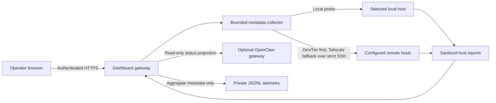
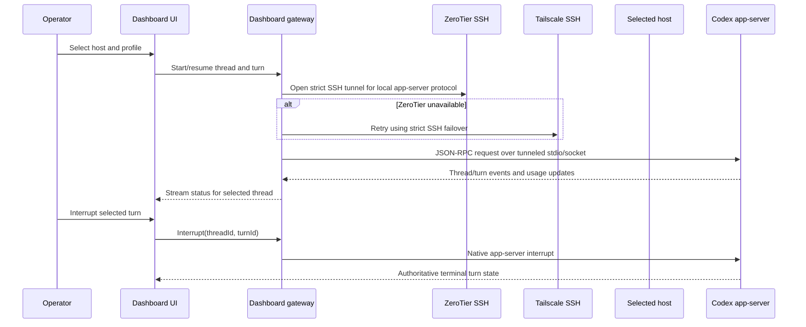

# Architecture and operating model

## System shape

The dashboard has two planes:

- **Observe:** the Next.js gateway polls bounded host metadata and presents Codex app-server, Herdr, Treehouse, and optional OpenClaw state.
- **Control (planned):** an authenticated dashboard API connects to one explicitly selected host’s Codex app-server for thread/turn work, or to Herdr for named-session lifecycle actions. OpenClaw delegation is a separate, explicit path.

The host inventory and SSH keys are private local configuration. Remote SSH uses the first configured route, with ZeroTier first and Tailscale as failover. Both routes use `BatchMode=yes`, strict host-key checking, and a stable per-host key alias. The dashboard does not expose general SSH or service-manager actions.

## 1. Observation and metadata flow

The collector reports connectivity, versions, aggregate counts, process CPU/RSS, and worktree metadata. It excludes prompts, transcripts, terminal output, credentials, and process environment variables. The UI polls host metadata every 30 seconds. App-server event streams should provide interactive turn state once the control plane is implemented; transcript reads are not needed for status.

## 2. Selected-host Codex interaction

Stdio is the app-server transport, carrying bidirectional JSON-RPC; it is not a restriction to one-way output. Keep the app-server endpoint local to its host and tunnel the stream through verified SSH. Show the selected host, profile, thread, and turn throughout the interaction. If a browser disconnects, reconnect and query authoritative thread/turn state instead of assuming the turn stopped.

Use Codex app-server directly for Codex threads and turns. Use Herdr’s named-session interface for Herdr start/stop and state. Do not expose arbitrary remote shell, host service lifecycle, or daemon restart controls. If the selected host is unreachable, report the failed ZeroTier attempt and Tailscale fallback result; do not imply a turn was interrupted when the control connection failed.

OpenClaw delegation has a separate explicit action, target, and task/session ID. The recommended adapter is the OpenClaw ACP bridge because the dashboard acts as a client starting a task through OpenClaw. Use A2A for agent-to-agent task delegation/federation when that becomes the actual problem; it does not control an existing Codex app-server thread. Do not claim the dashboard can cancel delegated OpenClaw work unless the selected OpenClaw interface supports cancellation.

## Profiles and permission controls

Dashboard-managed profiles are isolated from the shared fleet profile and from other local Codex profiles. A managed profile uses `approval_policy = "never"`, `sandbox_mode = "workspace-write"`, and the selected host user’s `$HOME` as the writable root. This preserves sandbox enforcement while suppressing approval prompts for eligible command actions.

The dashboard’s requested network switch is **on by default** for each new managed profile. It controls two distinct settings together: sandboxed command networking (`sandbox_workspace_write.network_access`) and Codex web search mode (`web_search`). On means command networking and live search are available; off means command networking is disabled and web search is disabled. A change applies to subsequent turns/profile runs; it cannot retract a request already sent. The UI must name the scope clearly because browser access, MCP servers, app connectors, and model traffic have separate network controls.

This profile is high-trust: with the switch on and `$HOME` writable, approved tools can change any file under that host user’s home and use outbound command networking. Keep the host/profile visible and record the actor, host alias, thread/turn identifiers, policy, timestamps, outcomes, and token usage. Do not log prompt or tool contents by default. `approval_policy = "never"` does not imply every unrelated connector or privileged operating-system prompt is bypassed; each integration keeps its own approval behavior.

## Telemetry, cost, and retention

| Signal | Collection | Token cost | Resource cost |
| --- | --- | --- | --- |
| Host health | Bounded SSH command: load, memory, disk, uptime, versions, process counts | None | One short command per host per interval; measure on the slowest hosts |
| Codex status | App-server event stream plus thread/turn state | None to observe | One persistent connection per active host/profile and small event payloads |
| Codex usage | App-server token-usage notifications: input, cached input, output, reasoning, total/context window | None to read | Negligible event parsing and storage |
| Herdr state | Event subscription with snapshot on reconnect | None to observe | Event-driven; snapshots only on reconnect or resync |
| OpenClaw health | Existing status projection | None to observe | One bounded local CLI call per refresh |
| Agent work | Codex turn, Herdr agent, or explicit OpenClaw task | Model-dependent | Usually the dominant host CPU/RAM cost; measure representative work |

Polling is approximately `host_count × 60 / interval_seconds` probes per minute. Five hosts at 30 seconds would mean about ten fleet probes per minute. Stagger probes, cap output and runtime, and keep app status event-driven. There is no transferable vendor benchmark for gateway or remote CPU/RSS in this deployment: record idle-monitoring and active-work baselines at the intended interval. See the research note for source links and detailed sizing guidance.

Keep 30 days of aggregate metadata and 7 days of bounded operational logs as the initial retention targets. Store logs with owner-only filesystem permissions. Never store credentials, environment values, prompts, transcripts, or raw terminal output by default.

## Host setup and configuration propagation

The private inventory is the source of truth for route order and host identity. Ansible uses the same order and host-key policy before applying user-scoped services. Linux uses systemd user units and lingering where configured; macOS uses LaunchAgents at GUI login. Codex auth files remain host-local. The shared profile sync changes only its four declared root settings and preserves MCP/plugin tables.

For plugin, skill, MCP, and profile propagation, distribute versioned non-secret manifests. Keep credentials and environment-specific MCP values on each host or in a secret manager. Apply changes in an opt-in dashboard-managed profile first, inspect effective config, then promote a reviewed policy to the shared fleet profile. Do not copy auth tokens between hosts.

## Boundaries and failure behavior

- The browser authenticates to the dashboard; host SSH credentials remain on the gateway and are never sent to the browser.
- The gateway allowlists host IDs and app-server/Herdr operations. Host selection is explicit per turn.
- Codex turns and Herdr named sessions are the only start/stop controls.
- Status snapshots are sanitized and bounded. An unreachable host returns unavailable state and the attempted transport without leaking command output.
- Recovery means reconnecting and reconciling selected thread/session state. It does not restart the Codex daemon or stop host services.

## Automatic Git publication

The repository Stop hook runs a public-snapshot scan, tests, lint, type checking, and a production build before staging/committing/tagging/pushing on `main`. It skips other branches and clean worktrees. Codex’s Stop hook payload provides a turn ID and last assistant message but no authoritative turn status. The current hook therefore uses the Stop event plus passing repository checks as its publish gate; exact completed-versus-failed turn gating belongs in the dashboard’s app-server event stream, where `turn/completed` includes the terminal status. Project hooks also require local review/trust in Codex before they run.

## Rollout

1. Keep the existing metadata dashboard and harden authentication/binding for the intended private network.
2. Add selected-host Codex thread start/resume, turn start, event streaming, turn interrupt, and token-usage display.
3. Add dashboard-managed profile creation with the requested permission defaults and the network switch on by default.
4. Add Herdr named-session start/stop and event/snapshot reconciliation.
5. Add explicit OpenClaw ACP delegation as a separate workflow.
6. Benchmark idle telemetry and representative active turns on the gateway and slowest remote host.
